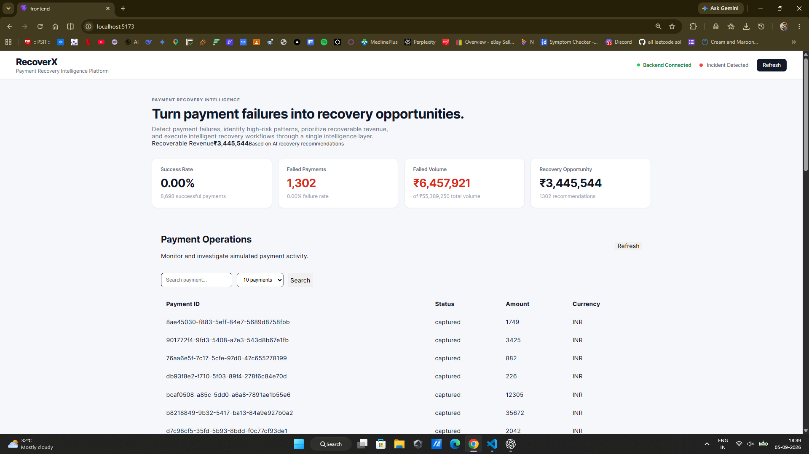
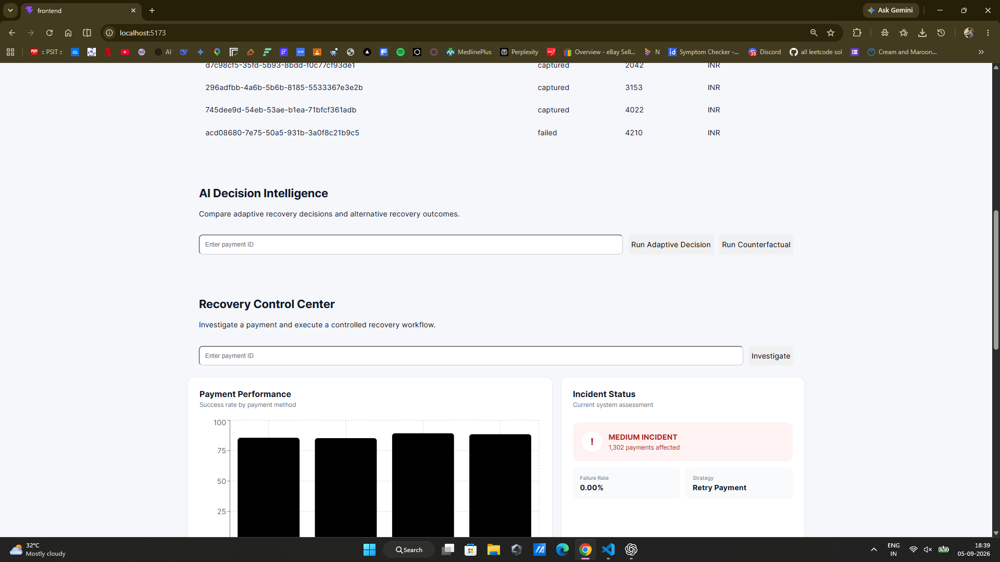
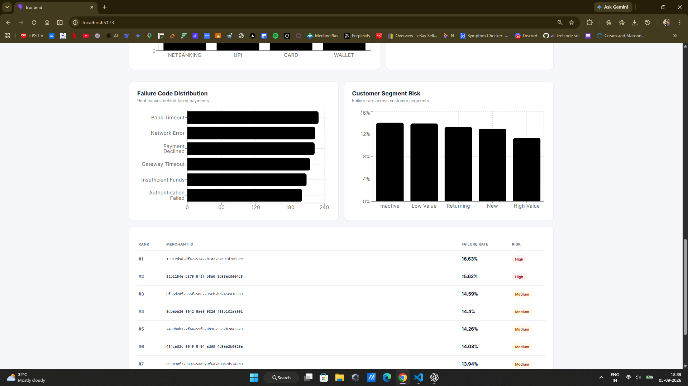
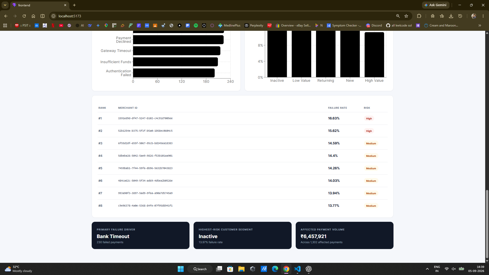

# RecoverX

## AI-Powered Payment Recovery Intelligence Platform

> Turn payment failures into intelligent recovery opportunities.

RecoverX is an intelligent payment recovery platform designed to help businesses monitor payment activity, investigate payment failures, identify risk patterns, and support data-driven recovery decisions.

Instead of treating every failed transaction as a simple error, RecoverX transforms payment failures into structured recovery intelligence.

**Detect → Investigate → Analyze → Decide → Recover**

---

## 🚀 Overview

Digital businesses process thousands of transactions across multiple payment methods, merchants, customer segments, and payment infrastructures.

When a payment fails, important questions often remain unanswered:

- Why did the payment fail?
- Is the failure temporary or permanent?
- Is the issue isolated or affecting multiple transactions?
- Which payment method is experiencing elevated failures?
- Which customer segments are most affected?
- Which merchants have higher failure rates?
- What recovery strategy should be considered?
- How much revenue could potentially be recovered?

RecoverX is designed to provide a centralized **payment recovery intelligence layer** that helps transform raw payment activity into actionable insights.

The platform focuses on moving from:

> **"A payment failed."**

to:

> **"This payment failed due to a likely temporary issue. Similar failures may be recoverable using an appropriate recovery strategy."**

---

# 🎯 Problem Statement

Payment failures can result in lost revenue, poor customer experience, and increased operational effort.

A failed transaction may occur because of:

- Bank timeout
- Network failure
- Payment decline
- Gateway timeout
- Authentication failure
- Insufficient funds
- Temporary payment infrastructure issues

Traditional payment monitoring systems often focus primarily on transaction status:

```text
SUCCESS
FAILED
PENDING
```

However, a payment status alone does not provide sufficient intelligence for recovery decisions.

Payment operations teams need to understand:

- Failure causes
- Failure patterns
- Risk signals
- Customer impact
- Merchant impact
- Recovery opportunities
- Recommended next actions

RecoverX addresses this problem by providing structured payment intelligence and recovery decision support.

---

# 💡 Solution

RecoverX transforms raw payment activity into structured recovery intelligence.

The platform is designed around the following capabilities:

- Payment failure detection
- Payment monitoring
- Failure investigation
- Incident identification
- Payment performance analysis
- Failure reason analysis
- Customer risk analysis
- Merchant risk analysis
- Recovery opportunity estimation
- Adaptive decision support
- Counterfactual recovery analysis
- Recovery strategy recommendations

The objective is to move from:

> **"A payment failed."**

to:

> **"This payment failed due to a likely temporary issue. Similar failures may be recoverable using a retry strategy. A retry is recommended based on the available payment context."**

---

# 🧠 Core Workflow

RecoverX follows a structured payment recovery intelligence workflow.

```text
Payment Activity
       │
       ▼
Failure Detection
       │
       ▼
Incident Identification
       │
       ▼
Payment Investigation
       │
       ▼
Risk & Pattern Analysis
       │
       ▼
AI Decision Intelligence
       │
       ├───────────────┐
       ▼               ▼
Adaptive Decision   Counterfactual Analysis
       │               │
       └───────┬───────┘
               │
               ▼
     Recovery Recommendation
               │
               ▼
       Recovery Opportunity
```

---

# ✨ Key Features

## 1. Payment Recovery Intelligence Dashboard

The RecoverX dashboard provides a centralized overview of payment performance and recovery opportunities.

Key metrics may include:

- Payment success rate
- Number of failed payments
- Failed payment volume
- Recovery opportunity
- Active incidents
- Recovery recommendations
- Payment performance trends

This enables users to quickly understand the overall payment ecosystem.

---

## 2. Payment Operations Monitoring

RecoverX provides a centralized view of payment activity.

Each payment can include information such as:

- Payment ID
- Payment status
- Transaction amount
- Currency
- Payment method
- Failure reason
- Customer information
- Merchant information
- Transaction timestamp

Users can search and investigate individual payments.

This provides the foundation for deeper payment-level analysis.

---

## 3. AI Decision Intelligence

The AI Decision Intelligence module is designed to support intelligent recovery decisions.

Users can analyze failed payments and evaluate possible recovery strategies.

Potential recovery strategies include:

- Retry payment
- Delay retry
- Change payment method
- Use an alternative recovery flow
- Escalate for investigation
- Avoid retrying potentially unrecoverable payments

The objective is to avoid applying the same recovery action to every failed transaction.

---

## 4. Adaptive Decision Support

Adaptive decision support evaluates available payment signals and recommends an appropriate recovery action.

```text
Payment Failure
       │
       ▼
Analyze Failure Context
       │
       ▼
Evaluate Risk Signals
       │
       ▼
Determine Recovery Strategy
       │
       ▼
Recommend Action
```

### Example Recommendation

**Failure Reason**

Bank Timeout

**Risk Level**

Medium

**Recommended Strategy**

Retry Payment

**Reason**

> The failure appears temporary and similar transactions may be recoverable through retry.

---

## 5. Counterfactual Analysis

Counterfactual analysis explores alternative recovery scenarios.

Instead of only asking:

> **What should we do now?**

RecoverX can support analysis around:

> **What could happen if we choose a different recovery strategy?**

### Example

**Current Strategy**

Retry Payment

**Alternative Strategy**

Use Another Payment Method

**Alternative Scenario**

Compare possible recovery outcomes.

This approach makes recovery decisions more analytical and explainable.

---

## 🔍 6. Recovery Control Center

The Recovery Control Center provides a focused workflow for investigating individual payments.

Users can:

- Enter a Payment ID
- Retrieve payment information
- Investigate failure context
- Analyze risk signals
- Review incident information
- Generate recovery recommendations

The goal is to bring payment investigation and recovery decision-making into a single workflow.

---

## 🚨 7. Incident Detection

RecoverX can identify abnormal payment failure patterns.

An incident may contain information such as:

- Incident severity
- Number of affected payments
- Failure rate
- Primary failure reason
- Affected payment method
- Recommended recovery action

### Example

**Incident Detected**

**Severity:** Medium

**Affected Payments:** 1,302

**Primary Failure:** Bank Timeout

**Recommended Strategy:** Retry Payment

This helps determine whether failures are isolated or part of a larger payment ecosystem issue.

---

## 📊 8. Payment Performance Analysis

RecoverX analyzes payment performance across payment methods.

Possible categories include:

- UPI
- Cards
- Netbanking
- Wallets

### Example

```text
Payment Method Performance

UPI         → Stable
Card        → Increased Failures
Wallet      → Moderate Failures
Netbanking  → Elevated Timeout Issues
```

These insights can help prioritize investigation and recovery efforts.

---

## 📉 9. Failure Code Analytics

RecoverX analyzes the distribution of payment failure reasons.

Possible failure categories include:

- Bank Timeout
- Network Error
- Payment Declined
- Gateway Timeout
- Insufficient Funds
- Authentication Failed

### Example

**Primary Failure Driver**

Bank Timeout

**230 Failed Payments**

Understanding dominant failure patterns can improve recovery strategy selection.

---

## 👥 10. Customer Segment Risk Analysis

Different customer groups may demonstrate different payment behavior and failure patterns.

RecoverX can analyze risk across customer segments such as:

- New
- Returning
- High Value
- Low Value
- Inactive

### Example

**Highest-Risk Customer Segment**

Inactive

**Failure Rate:** 13.7%

These insights can support more targeted recovery strategies.

---

## 🏪 11. Merchant Risk Intelligence

RecoverX provides merchant-level payment risk analysis.

Merchants can be ranked according to observed failure patterns.

| Rank | Merchant | Failure Rate | Risk |
|---|---|---:|---|
| #1 | Merchant A | 16.63% | High |
| #2 | Merchant B | 15.62% | High |
| #3 | Merchant C | 14.59% | Medium |

This allows payment operations teams to prioritize investigation.

---

## 💰 12. Recovery Opportunity Estimation

One of the primary goals of RecoverX is to estimate potential recoverable revenue.

Instead of only displaying failed payment volume, the platform focuses on:

```text
Failed Payments
       │
       ▼
Failed Payment Volume
       │
       ▼
Potentially Recoverable Payments
       │
       ▼
Recovery Opportunity
```

### Example

**Affected Payment Volume**

₹6,457,921

**Across 1,302 Failed Payments**

This helps businesses understand the financial impact of payment failures.

---

---

# 📸 Platform Preview

## 🖥️ Payment Recovery Intelligence Dashboard

RecoverX provides a centralized view of payment activity, failure patterns, recovery opportunities, and payment intelligence.



The dashboard provides visibility into:

- Payment success rate
- Failed payments
- Failed payment volume
- Recovery opportunity
- Payment operations
- Backend connection status
- Active payment incidents

---

## 🧠 AI Decision Intelligence

The AI Decision Intelligence module allows users to analyze failed payments and compare possible recovery approaches.



Users can:

- Enter a Payment ID
- Run an adaptive recovery decision
- Run counterfactual analysis
- Investigate payment failure context
- Generate recovery recommendations
- Access the Recovery Control Center

The goal is to move from simple payment monitoring toward intelligent recovery decision support.

---

## 📊 Payment Intelligence Analytics

RecoverX analyzes payment performance and failure patterns across the payment ecosystem.



The analytics layer provides insights into:

- Payment method performance
- Failure code distribution
- Customer segment risk
- Payment failure trends
- Risk concentration

This helps identify where payment failures are occurring and which areas require investigation.

---

## 🏪 Merchant Risk Intelligence

RecoverX ranks merchants based on observed payment failure patterns and risk levels.



The platform highlights key intelligence such as:

- Merchant failure rankings
- Failure rates
- Risk classification
- Primary payment failure driver
- Highest-risk customer segment
- Affected payment volume

This enables payment operations teams to prioritize investigation and recovery efforts.

---

# 🏗️ System Architecture

The RecoverX architecture is organized around multiple intelligence components.

```text
┌─────────────────────┐
│  Payment Activity   │
└──────────┬──────────┘
           │
           ▼
┌─────────────────────┐
│ Failure Detection   │
└──────────┬──────────┘
           │
           ▼
┌─────────────────────┐
│ Incident Detection  │
└──────────┬──────────┘
           │
           ▼
┌────────────────────────────────────┐
│   Payment Intelligence Layer       │
│                                    │
│  • Failure Analysis                │
│  • Payment Method Analysis         │
│  • Customer Risk Analysis          │
│  • Merchant Risk Analysis          │
└─────────────────┬──────────────────┘
                  │
                  ▼
┌────────────────────────────────────┐
│      Decision Intelligence         │
│                                    │
│  • Adaptive Decisions              │
│  • Counterfactual Analysis         │
│  • Recovery Strategy Selection     │
└─────────────────┬──────────────────┘
                  │
                  ▼
┌─────────────────────┐
│ Recovery Control    │
│ Center              │
└──────────┬──────────┘
           │
           ▼
┌─────────────────────┐
│ Revenue Recovery    │
│ Opportunity         │
└─────────────────────┘
```

---

# 📱 Platform Modules

RecoverX consists of multiple intelligence and operations modules.

## 1. Payment Recovery Intelligence

Provides a high-level overview of payment performance and recovery opportunities.

## 2. Payment Operations

Supports monitoring and investigation of payment activity.

## 3. AI Decision Intelligence

Supports adaptive recovery decisions and strategy recommendations.

## 4. Recovery Control Center

Provides a structured workflow for investigating individual failed payments.

## 5. Payment Performance Analytics

Compares payment performance across payment methods.

## 6. Failure Code Analytics

Identifies significant payment failure reasons.

## 7. Customer Segment Risk Analysis

Analyzes payment failure patterns across customer segments.

## 8. Merchant Risk Intelligence

Ranks merchants according to observed payment failure patterns.

## 9. Payment Simulation

Simulates payment activity and failure scenarios for testing and demonstration.

## 10. Payment Integrations

Provides integration points for payment-related services and workflows.

---

# 🎨 Dashboard Intelligence

The RecoverX dashboard is designed to provide a centralized view of payment recovery intelligence.

```text
┌──────────────────────────────────────────────┐
│                   RecoverX                   │
│       Payment Recovery Intelligence          │
├──────────────────────────────────────────────┤
│                                              │
│ Success Rate │ Failed Payments │ Recovery    │
│              │                 │ Opportunity│
│                                              │
├──────────────────────────────────────────────┤
│                                              │
│            Payment Operations                │
│                                              │
├──────────────────────────────────────────────┤
│                                              │
│         AI Decision Intelligence             │
│                                              │
├──────────────────────────────────────────────┤
│                                              │
│         Recovery Control Center              │
│                                              │
├──────────────────────────────────────────────┤
│                                              │
│ Payment Performance │ Incident Detection     │
│                                              │
├──────────────────────────────────────────────┤
│                                              │
│ Failure Analytics │ Customer Risk Analysis   │
│                                              │
├──────────────────────────────────────────────┤
│                                              │
│          Merchant Risk Intelligence          │
│                                              │
└──────────────────────────────────────────────┘
```

---

# 🔄 Payment Recovery Lifecycle

RecoverX is designed around a continuous payment recovery lifecycle.

```text
Detect Failure
      ↓
Understand Failure Context
      ↓
Analyze Patterns
      ↓
Estimate Risk
      ↓
Select Recovery Strategy
      ↓
Execute or Recommend Recovery
      ↓
Measure Outcome
      ↓
Learn From Results
```

The long-term objective is to make payment recovery increasingly adaptive.

---

# 🎯 Use Cases

## FinTech Platforms

Identify potentially recoverable payment failures and prioritize recovery opportunities.

## Payment Gateways

Analyze payment failure patterns across merchants and payment methods.

## E-Commerce Platforms

Reduce potential revenue loss caused by failed checkout transactions.

## Subscription Businesses

Analyze recurring payment failures and recommend appropriate recovery actions.

## Financial Operations Teams

Investigate payment incidents and prioritize recovery workflows.

## Payment Risk Teams

Identify abnormal payment failure patterns across merchants and customer segments.

---

# 🧪 Payment Simulation

RecoverX can support simulated payment scenarios for testing and demonstration.

Example scenarios may include:

- Successful Payment
- Failed Payment
- Bank Timeout
- Network Failure
- Payment Declined
- Gateway Timeout
- Authentication Failure

Simulation enables development and testing of payment intelligence workflows without relying exclusively on production payment events.

---

# 🤖 Recovery Strategy Examples

RecoverX can support multiple recovery strategies.

| Failure Type | Possible Recovery Strategy |
|---|---|
| Bank Timeout | Retry Payment |
| Network Error | Delayed Retry |
| Payment Declined | Alternative Payment Method |
| Gateway Failure | Alternative Payment Route |
| Authentication Failure | Customer Reauthentication |
| Insufficient Funds | Notify Customer / Retry Later |

These strategies should ultimately be selected based on payment context and observed recovery outcomes.

---

# 🧠 Decision Intelligence

RecoverX is designed to shift payment operations from monitoring toward decision intelligence.

Traditional systems answer:

> **What happened?**

RecoverX aims to answer:

- Why did it happen?
- How severe is the problem?
- Who is affected?
- What should we do next?
- What alternative strategies are available?
- How much revenue could potentially be recovered?

---

# 📊 Example Insights

RecoverX can help generate insights such as:

**Primary Payment Failure Driver**

Bank Timeout

**Highest-Risk Customer Segment**

Inactive

**Merchant With Elevated Failure Rate**

Merchant A

**Recommended Recovery Strategy**

Retry Payment

**Potential Recovery Opportunity**

₹X Potentially Recoverable

---

# 🔮 Future Enhancements

## 🤖 Machine Learning-Based Recovery Prediction

Predict the probability that a failed payment can be successfully recovered.

```text
Recovery Probability

Retry Payment
████████████████░░░ 82%

Alternative Payment Method
██████████████░░░░░ 71%

Delayed Retry
████████████░░░░░░░ 61%
```

---

## ⏱ Intelligent Retry Timing

Determine the most appropriate retry window.

```text
Retry Immediately
Probability: 42%

Retry After 15 Minutes
Probability: 71%

Retry After 1 Hour
Probability: 63%
```

---

## 🔀 Smart Payment Routing

Recommend alternative payment routes when specific payment infrastructure experiences elevated failure rates.

---

## 📩 Automated Customer Recovery

Potential integrations could include:

- SMS
- Email
- WhatsApp
- Push Notifications

### Example

> Your payment could not be completed. Retry using a recommended payment method.

---

## 🔔 Real-Time Incident Alerts

Automatically notify payment operations teams when abnormal failure patterns are detected.

```text
🚨 PAYMENT INCIDENT DETECTED

Failure Rate:
Increased Significantly

Primary Cause:
Bank Timeout

Affected Payments:
1,302

Recommended Action:
Activate Recovery Workflow
```

---

## 📈 Historical Recovery Analytics

Measure the effectiveness of recovery strategies over time.

| Strategy | Recovery Rate |
|---|---:|
| Retry Payment | 68% |
| Alternative Method | 54% |
| Delayed Retry | 61% |
| No Action | 12% |

---

# 🧠 Continuous Learning Loop

A future version of RecoverX could learn from historical recovery outcomes.

```text
Payment Failure
      ↓
Recovery Strategy
      ↓
Recovery Outcome
      ↓
Historical Data
      ↓
Model Learning
      ↓
Improved Future Recommendations
```

---

# 🛣️ Product Vision

RecoverX is built around a simple idea:

> **A failed payment should not automatically become lost revenue.**

Every failed transaction can contain useful information.

By combining:

- Payment analytics
- Failure investigation
- Incident detection
- Risk analysis
- Decision intelligence
- Recovery strategy selection

RecoverX aims to help businesses identify:

> **Which payments are worth recovering?**

and:

> **What is the best action to take?**

The long-term vision is to build an intelligent recovery layer capable of continuously:

```text
Detecting Failures
      ↓
Understanding Causes
      ↓
Estimating Recoverability
      ↓
Selecting the Best Strategy
      ↓
Supporting Recovery Execution
      ↓
Measuring Results
      ↓
Learning From Outcomes
```

---

# 🏆 Why RecoverX?

Traditional payment dashboards primarily answer:

> **What happened?**

RecoverX aims to go further.

- Why did it happen?
- What is the risk?
- Who is affected?
- What should happen next?
- What alternative strategy could work?
- How much revenue could potentially be recovered?

This transition from simple monitoring to intelligent decision support is the core philosophy behind RecoverX.

---

# 📌 Key Insights Generated by RecoverX

RecoverX is designed to surface insights such as:

- Primary payment failure drivers
- Payment failure patterns
- Incident severity
- Affected payment volume
- Payment method performance
- Customer segment risk
- Merchant risk ranking
- Recovery opportunities
- Recommended recovery strategies
- Alternative recovery scenarios

---

# 🚀 Getting Started

## Clone the Repository

```bash
git clone https://github.com/kartikay120904/RecoverX.git
```

## Navigate to the Project

```bash
cd RecoverX
```

Then follow the setup instructions based on the frontend, backend, and supporting components present in the repository.

---

# ⚙️ Environment Variables

For services requiring API credentials or external integrations, environment variables should be used.

Example:

```env
PAYMENT_API_KEY=your_key_here
PAYMENT_API_SECRET=your_secret_here

BACKEND_URL=your_backend_url

DATABASE_URL=your_database_connection

AI_API_KEY=your_ai_service_key
```

> Never commit production credentials or secret keys to the repository.

Use environment files such as:

```text
.env
```

Ensure sensitive files are included in:

```text
.gitignore
```

---

# 🔐 Security Considerations

A production payment intelligence platform should ensure:

- Secure handling of payment-related information
- No unnecessary storage of sensitive payment credentials
- Secure API communication
- Authentication and authorization
- Role-based access control
- Audit logging
- Secure environment variable management
- Encryption of sensitive data where required
- Compliance with applicable payment and data protection requirements

RecoverX is intended as a payment intelligence and decision-support platform.

Sensitive payment credentials should not be unnecessarily exposed, stored, or logged.

---

# 🤝 Contributing

Contributions, ideas, and improvements are welcome.

To contribute:

1. Fork the repository.
2. Create a feature branch.

```bash
git checkout -b feature/your-feature-name
```

3. Make your changes.
4. Commit your changes.

```bash
git commit -m "Add your feature"
```

5. Push the branch.

```bash
git push origin feature/your-feature-name
```

6. Open a Pull Request.

---

# 📂 Repository

[RecoverX Repository](https://github.com/kartikay120904/RecoverX)

---

# 👨‍💻 Author

**Kartikay Maurya**

Engineering Student | AI & Software Development

GitHub: [kartikay120904](https://github.com/kartikay120904)

LinkedIn: [Kartikay Maurya](https://linkedin.com/in/kartikay-maurya-7a5a5324a)

---

# ⭐ Support

If you find RecoverX interesting or useful, consider giving the repository a ⭐.

Your support helps improve and continue the development of the project.

---

# 📄 License

This project is currently provided for educational, research, and project demonstration purposes.

A dedicated license can be added depending on the intended future usage and distribution model.